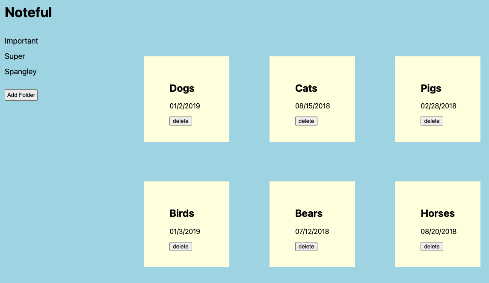
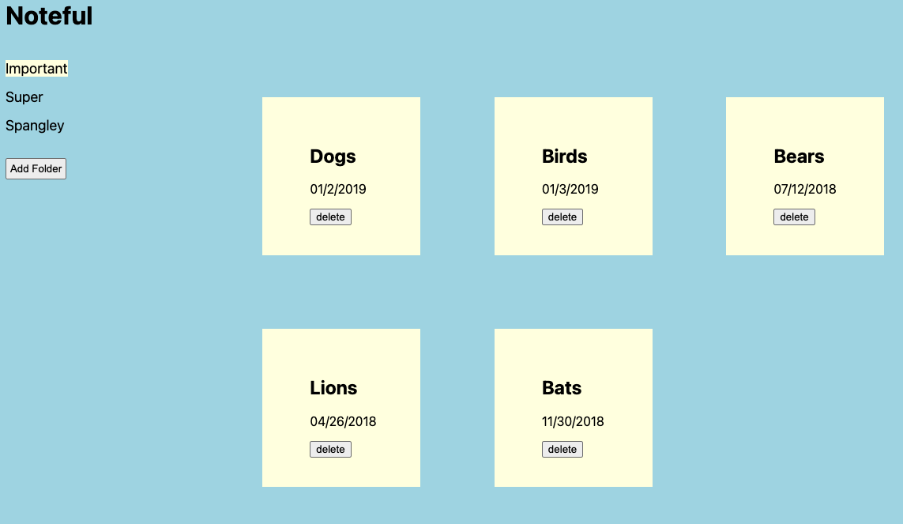
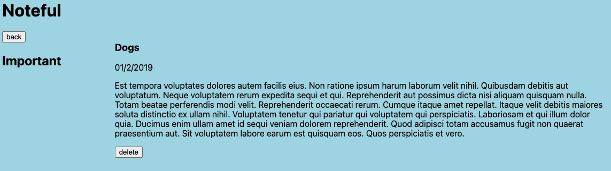
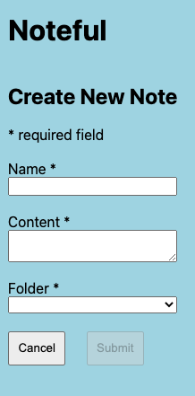
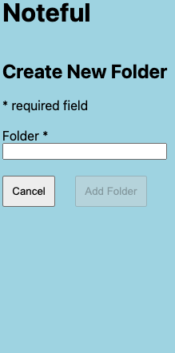

# Noteful 2

This project was bootstrapped with [Create React App](https://github.com/facebook/create-react-app). 
This is a Thinkful assignment.
This app is to be used with [noteful-api](https://github.com/7424243/noteful-api).

## Available Scripts

In the project directory, you can run:

### `npm start`
### `npm test`

## Screenshots

### Home

### Folder View

### Note View

### Add Note View

### Add Folder View

## Summary

This app allows users to access their notes with a GET request. Users can also create a new note or a new folder with a POST request and delete a note with a DELETE request.

## Built With

* JavaScript
* React
* HTML
* CSS
